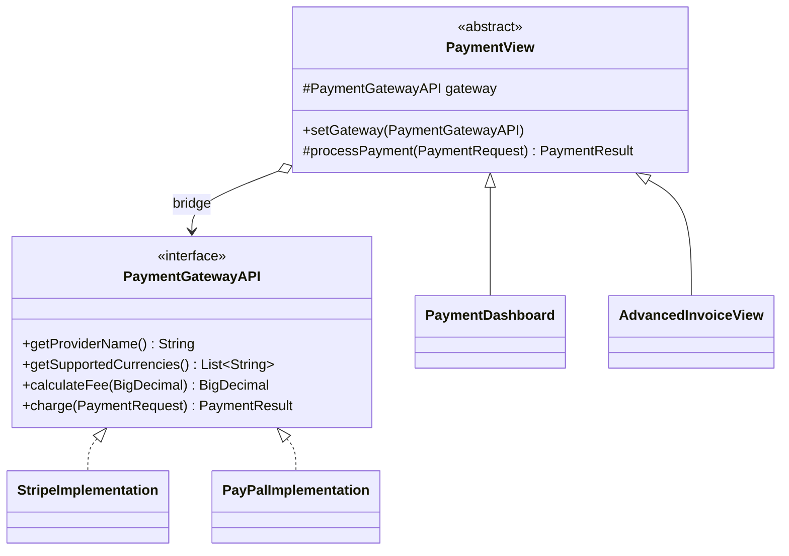
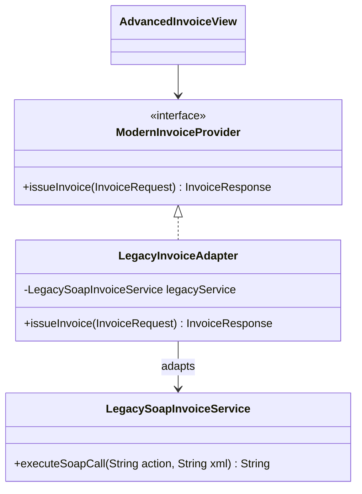

# Enterprise Payment & Invoice Gateway

Java 17 + Swing (FlatLaf) desktop application that demonstrates the **Bridge** and **Adapter** design patterns
in a multi-platform payment and invoicing scenario.

## Run

```bash
mvn exec:java            # run from sources
mvn package              # build + run the tests
java -jar target/payment-invoice-gateway-1.0.0.jar
```

Requirements: JDK 17+ and Maven 3.8+.

## Project structure

```
payment-invoice-gateway/
├── pom.xml
└── src/
    ├── main/java/com/paymentgateway/
    │   ├── App.java                         # Entry point + composition root (wires everything)
    │   ├── model/                           # Immutable data (Java records)
    │   │   ├── PaymentRequest.java
    │   │   ├── PaymentResult.java
    │   │   ├── InvoiceRequest.java
    │   │   ├── InvoiceResponse.java         # toJson()
    │   │   └── InvoiceStatus.java
    │   ├── bridge/
    │   │   ├── abstraction/                 # BRIDGE: Abstraction side (UI)
    │   │   │   ├── PaymentView.java         #   Abstraction (holds the bridge)
    │   │   │   ├── PaymentDashboard.java    #   Refined Abstraction #1
    │   │   │   └── AdvancedInvoiceView.java #   Refined Abstraction #2
    │   │   └── implementation/              # BRIDGE: Implementation side (APIs)
    │   │       ├── PaymentGatewayAPI.java   #   Implementor
    │   │       ├── StripeImplementation.java#   Concrete Implementor
    │   │       └── PayPalImplementation.java#   Concrete Implementor
    │   ├── adapter/                         # ADAPTER
    │   │   ├── ModernInvoiceProvider.java   #   Target (modern, JSON-friendly)
    │   │   ├── LegacyInvoiceAdapter.java    #   Adapter
    │   │   ├── AdapterStage.java            #   Translation steps (drive the UI animation)
    │   │   └── InvoiceProcessingException.java
    │   ├── legacy/
    │   │   └── LegacySoapInvoiceService.java#   Adaptee (third-party SOAP/XML, not modifiable)
    │   └── ui/
    │       ├── MainFrame.java               # Window, gateway selector, tabs
    │       ├── theme/AppTheme.java          # FlatLaf setup, colors, light/dark mode
    │       └── components/                  # Reusable widgets
    │           ├── CardPanel.java
    │           ├── GradientPanel.java       # Gradient header / banners
    │           ├── StatTile.java            # KPI tiles on the dashboard
    │           ├── StatusBadge.java
    │           ├── KeyValuePanel.java
    │           ├── PaymentFormPanel.java
    │           ├── InvoicePreviewPanel.java # Invoice rendered as a document
    │           └── AdapterFlowPanel.java    # Animated Adapter diagram
    └── test/java/com/paymentgateway/
        ├── bridge/PaymentGatewayImplementationsTest.java
        ├── bridge/PaymentViewBridgeTest.java
        └── adapter/LegacyInvoiceAdapterTest.java
```

## Bridge pattern

**Problem:** we have several screens (dashboard, invoice view…) and several payment providers (Stripe, PayPal…).
With inheritance alone we would need one class per combination (`StripeDashboard`, `PayPalDashboard`,
`StripeInvoiceView`, …), and the number of classes would keep multiplying.

**Solution:** split the design into two hierarchies connected by a reference (the *bridge*).



- Changing the gateway in the header calls `setGateway(...)` on the **same view objects**: the UI stays,
  the implementation changes (currencies, fees, transaction IDs and business rules all update).
- Adding a new provider (e.g. `MercadoPagoImplementation`) = 1 new class, 0 changes to views.
- Adding a new screen = 1 new `PaymentView` subclass, 0 changes to gateways.

## Adapter pattern

**Problem:** the company must keep using an old invoicing system (`LegacySoapInvoiceService`) that only speaks
SOAP/XML, uses fields like `CUST_NAME` / `AMT_VALUE`, status codes `"A"/"P"/"R"` and dates as
`dd/MM/yyyy HH:mm:ss`. Our code works with Java objects and JSON through `ModernInvoiceProvider`.

**Solution:** `LegacyInvoiceAdapter` implements `ModernInvoiceProvider` and wraps the legacy service (object adapter / composition).



| Modern side (`InvoiceRequest` / `InvoiceResponse`) | Legacy side (SOAP XML) |
|---|---|
| `customerName`                                      | `CUST_NAME`            |
| `amount`                                            | `AMT_VALUE`            |
| `paymentReference`                                  | `REF_TXN`              |
| `InvoiceStatus.ISSUED / PENDING / REJECTED`         | `A / P / R`            |
| `LocalDateTime` (ISO-8601 in JSON)                  | `dd/MM/yyyy HH:mm:ss`  |
| `InvoiceProcessingException`                        | `<soap:Fault>`         |

The **Advanced Invoice View** tab renders the resulting invoice as a document and shows an animated
diagram (*Invoice View ↔ Invoice Adapter ↔ Legacy Service*) driven by the `AdapterStage` events the
adapter reports: request received → translated to SOAP → legacy answered → mapped back to a modern invoice.

## Test scenarios

| Try this | Result |
|---|---|
| Stripe, amount `50.13` | Declined: `card_declined` |
| PayPal, email containing `blocked` | Declined: account restricted |
| PayPal with amount > 10,000 | Declined: limit exceeded |
| Switch Stripe ↔ PayPal | Currencies, fees and button labels update instantly |
| Invalid email / amount | Validation message, nothing is sent |
